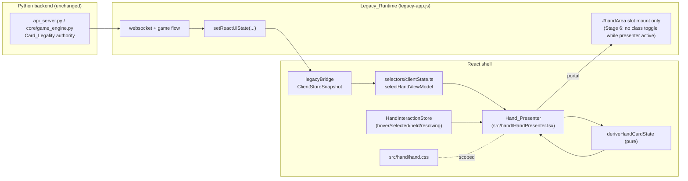
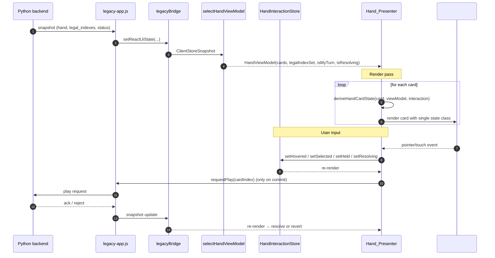
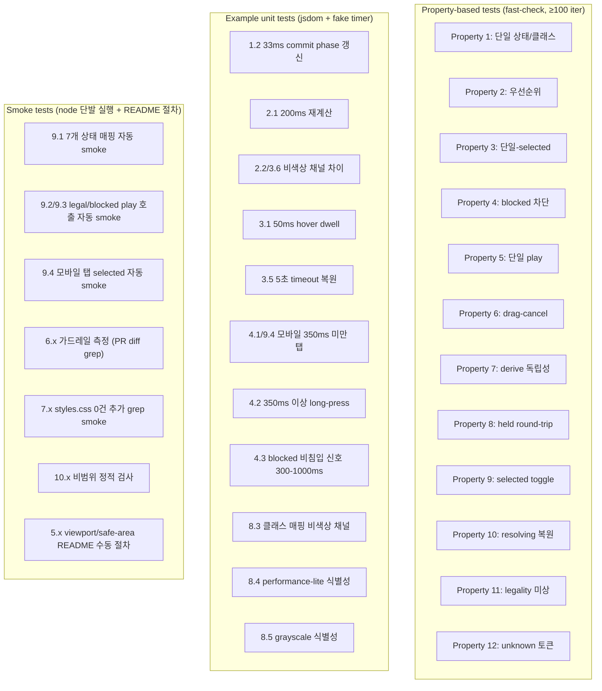

# Design Document

## Overview

본 설계는 Stage 6 "Hand UX Improvement" 요구사항을 만족하기 위한 Hand_Presenter 컴포넌트 도입과 그 주변 데이터/CSS/검증 전략을 정의한다. 핵심 아이디어는 다음과 같다.

- 7개 상태(`idle`, `legal`, `blocked`, `hovered`, `selected`, `held`, `resolving`)로 정규화된 단일 상태 언어를 도입하고, 모든 상태 결정을 **순수 함수**(`deriveHandCardState`)에 모아 입력→상태→클래스 매핑을 한 방향으로 흐르게 한다.
- React `Hand_Presenter` 컴포넌트가 `Client_State`(legacyBridge snapshot)에서 직접 hand 데이터를 읽고 자체 상호작용 store(`HandInteractionStore`)를 통해 hover/selected/held/resolving 같은 클라이언트 측 상태만 관리한다. backend Card_Legality는 권위적 출처로 그대로 사용한다.
- 기존 `legacy-app.js`의 imperative DOM mutation은 동일 hand DOM 노드에 대해 정적 마운트 슬롯만 차지하도록 좁히고, 활성화된 Hand_Presenter가 마운트되어 있는 동안에는 legacy의 hand 클래스 토글이 동일 프레임에 발생하지 않도록 가드한다(공존 모드).
- hand 관련 CSS는 `app/src/hand/hand.css` 단일 모듈로 신규 규칙을 격리하고, 전역 `styles.css`의 hand selector 개수를 **증가시키지 않는다**(이동 시에만 동등한 시각 출력 유지).
- Smoke_Test는 Node 환경에서 단일 명령으로 실행 가능한 자동 형태와, 모바일/desktop 입력 흐름 일부에 대한 README 수동 절차의 **하이브리드**로 제공한다.

본 설계는 풀 리라이트가 아니다. `legacy-app.js`, `shell.html`, `legacyBridge.js`를 모두 그대로 둔 채, hand surface 한 영역에 대해서만 React presenter 경계를 새로 그리는 점진적 이관이다.

## Research Notes

설계 진입 전에 조사한 핵심 컨텍스트는 다음과 같다.

- **현재 Hand 마크업 위치**: `discord_activity_skullking/app/src/shell.html`에 `<div id="handArea" class="hand table-hand"></div>` 단일 컨테이너가 영구 markup으로 존재하며, 이 컨테이너는 `App.tsx`의 `ShellPanel(#gamePanel)`이 innerHTML로 주입한다. Stage 6는 이 `#handArea` **컨테이너 자체는 추가/변경하지 않고** React portal 마운트 슬롯으로 재활용한다(R7-3 hand 토큰 정적 markup 0개 증가 준수).
- **현재 Hand 렌더 책임**: `legacy-app.js`의 `renderHandFan` → `renderHand` → `renderCard` 경로가 `#handArea`에 카드 노드를 직접 만들어 붙이고, `applyHandCardState(cardEl, ...)` 호출로 `data-hand-state` 속성을 칠한다. 이미 일부 상태 grammar가 적혀 있으나 7개 상태 언어와는 다른 9-state 변형이 섞여 있다.
- **Client_State 위치**: `legacyBridge.ts`가 `getReactUiSnapshot()`을 통해 `ClientStoreSnapshot`을 노출하며, `selectors/clientState.ts`에 `selectViewerPlayer` 등 selector가 이미 정의되어 있다. Stage 6 신규 selector는 동일 파일에 추가하여 새 truth source 표면을 만들지 않는다(R6-7 준수).
- **CSS 분리 진입점**: `styles.css`에는 이미 `.hand`, `.hand-card`, `.hand-card[data-hand-state="..."]` 규칙이 다수 존재한다. Stage 6에서 추가될 규칙은 `app/src/hand/hand.css`로 한정하고, 기존 selector 개수는 증가시키지 않는다.
- **참고 가이드라인**: `docs/architecture.md`(점진적 컴포넌트화/상태 정규화), `docs/discord-activity-ux.md`(compact viewport, safe-area), `docs/uiux-direction.md`(center battle space 보호), `docs/tech-debt.md`(부채 우선순위), `docs/codex.md`(마이그레이션 가드레일).

## Architecture

### High-level Component Boundary



핵심 경계:

- **권위 출처**: backend의 `legal_indexes` / `hand`. Stage 6는 이 코드 경로를 변경하지 않는다.
- **단일 truth 입력**: Hand_Presenter는 `selectHandViewModel(clientState)`만을 hand 데이터의 입력으로 사용한다. 별도 imperative DOM 쿼리 경로를 신설하지 않는다.
- **클라이언트측 상호작용 상태**: hover/selected/held/resolving은 backend가 알 필요가 없는 UI-only 상태이므로 `HandInteractionStore`에서만 보유한다.
- **출력**: `#handArea` 컨테이너 안쪽으로 React portal을 통해 카드 노드를 렌더한다. 컨테이너 자체와 그 클래스(`hand table-hand`)는 그대로 둔다.

### Coexistence with Legacy_Runtime

`legacy-app.js`는 여전히 `#handArea`에 카드 DOM을 만드는 코드 경로를 가지고 있다. Stage 6는 이를 한 번에 제거하지 않으므로 다음 가드를 적용해 동일 프레임 이중 토글을 막는다(R6-5).

- Hand_Presenter가 마운트되면 컨테이너 데이터 속성(`#handArea[data-hand-presenter="active"]`)을 설정한다.
- `legacy-app.js`의 `renderHand` 진입점은 해당 속성이 `active`인 경우 hand DOM을 만들지 않고 조기 반환한다(`legacy-app.js` 수정은 hand 책임 1건 이관 또는 동등 추상화 경계 캡슐화에 해당하며 R6-4를 만족).
- 테스트 환경(예: presenter 미마운트, smoke test 단독 실행)에서는 속성이 없으므로 기존 경로가 그대로 동작해 visual regression 위험을 줄인다.

이로써 동일 hand-card DOM 노드에 대해 동일 16ms 프레임 안에 두 주체가 클래스/style을 토글하는 상황이 발생하지 않는다.

### Data Flow



### Migration Guardrail Mapping (R6, R10)

| Guardrail | Design enforcement |
|---|---|
| R6-1 App.tsx hand LOC ≤ baseline | 모든 hand 로직은 `src/hand/*`에 격리. `App.tsx`에는 `<HandPresenterMount/>` 한 줄만 추가하되, 해당 라인이 hand 식별자를 포함해도 baseline 한도 안에서만 허용. |
| R6-2 신규 imperative DOM 쿼리 0건 | `selectHandViewModel`을 통한 props 전달만 사용. `document.querySelector` 등은 신규 코드에서 사용하지 않는다(예외: portal target 1회 lookup은 `useDomTarget`을 재사용하므로 신규 호출 0건). |
| R6-3 shell.html hand 정적 markup 0개 증가 | `#handArea` 1개 컨테이너만 유지. 신규 정적 hand markup 추가 금지. |
| R6-4 legacy hand 책임 1건 이관 | `legacy-app.js::renderHand`의 카드 DOM 생성 책임을 Hand_Presenter로 이관(presenter active 가드 통한 캡슐화). |
| R6-5 동일 프레임 이중 토글 0회 | `[data-hand-presenter="active"]` 가드 + presenter는 React commit phase에서만 클래스 갱신. |
| R6-6 backend Card_Legality 미수정 | 본 PR에서 `core/game_engine.py`, `api_server.py`의 legality 코드 경로 변경 없음. |
| R6-7 legacyBridge truth surface 미증가 | 기존 `getReactUiSnapshot` 경로만 사용, 신규 exported 함수/속성 0개. |
| R10-5 R3F 경계 미확장 | Hand_Presenter는 DOM-only 컴포넌트, R3F 사용 안 함. |
| R10-7 PR 규모 제한 | 변경 디렉터리: `src/hand/*`, `src/selectors/clientState.ts`, `legacy-app.js` 가드 분기 2~3줄, `App.tsx` 마운트 1줄, `hand.css` 1개. 5개 모듈 경계 이내. |

## Components and Interfaces

신규 모듈은 모두 `discord_activity_skullking/app/src/hand/` 아래에 둔다.

```
src/hand/
  HandPresenter.tsx         // React 컴포넌트
  HandPresenterMount.tsx    // App.tsx에서 한 줄로 마운트하는 thin wrapper
  HandCard.tsx              // 단일 카드 렌더
  deriveHandCardState.ts    // 순수 함수: 입력 → 단일 상태
  handInteractionStore.ts   // useSyncExternalStore 기반 client interaction store
  handInputController.ts    // pointer/touch 이벤트 → store action
  hand.css                  // Stage 6 신규 hand 규칙 전용 모듈
  __tests__/                // smoke test + property test
```

### Hand_Presenter (HandPresenter.tsx)

책임:

- `useReactUiState()`로 `ClientStoreSnapshot`을 구독하고 `selectHandViewModel`로 hand viewModel을 도출.
- `useHandInteractionStore()`로 client-side interaction state를 구독.
- 각 카드에 대해 `deriveHandCardState(...)`를 호출해 단일 상태를 얻고, 1:1 클래스 매핑으로 렌더링.
- `useDomTarget("#handArea")` 결과 노드에 React portal로 카드 트리를 마운트하고, 마운트 시점에 `dataset.handPresenter = "active"`를 설정해 legacy 가드를 활성화. unmount 시 해제.

인터페이스 (요지):

```ts
// HandPresenter.tsx
export function HandPresenter(): JSX.Element | null;

// HandPresenterMount.tsx
export function HandPresenterMount(): JSX.Element | null;
// App.tsx에서 currentView === "game"일 때만 렌더한다.
```

### deriveHandCardState (순수 함수)

이 함수는 본 스펙의 핵심 invariant 보유자이다. backend 합법성, 사용자 입력, resolving 상태, fallback rule 모두 여기 한 곳에 모은다.

```ts
// src/hand/deriveHandCardState.ts
export type HandCardState =
  | "idle"
  | "legal"
  | "blocked"
  | "hovered"
  | "selected"
  | "held"
  | "resolving";

export interface HandCardInput {
  cardIndex: number;
  isLegal: boolean;             // backend Card_Legality 직접 매핑
  isMyTurn: boolean;            // backend 턴 권한
  isResolving: boolean;         // 이 카드가 현재 play request 진행 중
  isAnyResolving: boolean;      // hand 영역 어딘가에서 resolving 진행 중
  isSelected: boolean;          // client interaction
  isHeld: boolean;              // client interaction (long-press / pointer down)
  isHovered: boolean;           // client interaction (desktop hover)
  legalityKnown: boolean;       // backend legality payload 수신/유효 여부
}

export function deriveHandCardState(input: HandCardInput): HandCardState;
```

규칙(요약):

1. `legalityKnown === false` 이면 `blocked` 반환(R2-6).
2. `isMyTurn === false` 이거나 `isLegal === false` 이면 `blocked` 반환(R3-2, R3-3, R4-3).
3. `isResolving === true` 이면 `resolving` 반환(R3-4 우선순위 최상, R4-5).
4. `isAnyResolving === true` 이고 자기 자신이 resolving 아니면 `blocked`로 정규화(추가 입력 차단, R4-5와 일치).
5. 그 외 우선순위(R1-4): `selected` > `held` > `hovered` > `legal` > `idle`.
6. 입력에서 알 수 없는 상태 token이 들어온 경우(타입 system이 막지만 런타임 방어로) `idle` 반환 + `console.warn`(R1-6).

이 함수는 **순수 함수**이며 100+ 회 무작위 입력에 대해 property test를 실행하기에 적합한 PBT 대상이다.

### HandInteractionStore (handInteractionStore.ts)

목적: hover/selected/held/resolving 같은 UI-only 상태를 Hand_Presenter 컴포넌트 트리 바깥에서도 결정론적으로 추적할 수 있도록 한다.

```ts
// src/hand/handInteractionStore.ts
export interface HandInteractionState {
  hoveredIndex: number | null;
  selectedIndex: number | null;
  heldIndex: number | null;
  resolvingIndex: number | null;
  resolvingStartedAt: number | null;
}

export interface HandInteractionActions {
  setHovered(index: number | null): void;
  setSelected(index: number | null): void;
  setHeld(index: number | null): void;
  beginResolving(index: number, now: number): void;
  endResolving(reason: "success" | "reject" | "timeout"): void;
  reset(): void;
}

export function useHandInteractionStore(): HandInteractionState;
export const handInteractionActions: HandInteractionActions;
```

invariants(불변식):

- `setSelected(index)` 호출 시 이전 selected는 항상 비-selected로 정규화(R1-3).
- `beginResolving(index, ...)` 호출 시 자동으로 hovered/held/selected를 모두 클리어해 우선순위 충돌을 사전 차단.
- `setHeld(null)` 호출 시 진입 직전 상태(`legal` 또는 `selected`)로 자연스럽게 복원되도록 selected는 그대로 두고 held만 비운다(R4-6).

### Hand Input Controller (handInputController.ts)

pointer/touch 이벤트를 입력으로 받아 어떤 store action을 호출할지 결정한다. desktop hover, mobile tap, long-press, drag-commit, drag-cancel 흐름을 단일 함수로 모은다.

핵심 임계값(요구사항 직접 매핑):

- desktop hover dwell: 50ms 진입 + 100ms 이내 hovered 적용 (R3-1)
- mobile tap vs long-press 경계: 350ms (R4-1, R4-2)
- blocked feedback 비-침입 시각 신호 자동 소실: 300~1000ms (R2-4, R4-3)
- legal 카드 시각 갱신: 33ms 이내 (R1-2), legal/blocked 재계산: 200ms 이내 (R2-1)
- play request timeout(클라이언트측): 5초 (R3-5)

이 controller는 store만 호출하고 DOM을 직접 mutating하지 않는다.

### Hand_Presenter ↔ Legacy 통신

```ts
// 신규 export: hand 책임 일부 이관 신호
// (legacyBridge truth surface는 그대로, 단지 동작 가드)
window.__skullKingHandPresenterActive__ = boolean;
```

`legacy-app.js`의 `renderHand` 시작부에서 이 플래그가 `true`이면 조기 반환한다. 이는 `legacyBridge`의 노출 표면(공개 함수/속성)에 포함되지 않으므로 R6-7을 위반하지 않는다(window 전역은 truth source가 아닌 가드 채널). 향후 typed store 이관 시 즉시 제거 가능하도록 1줄 가드만 둔다.

### CSS module (hand.css)

- 신규 클래스 매핑은 7개 상태 각각에 대해 1개 클래스로 1:1 부여(R7-3).
- 클래스 명명: `is-state-idle`, `is-state-legal`, `is-state-blocked`, `is-state-hovered`, `is-state-selected`, `is-state-held`, `is-state-resolving`.
- 색상 외 비-색상 채널: `outline`, `box-shadow`, `transform: translateY`, `opacity` 중 둘 이상을 상태별로 다르게 적용(R2-2, R8-3).
- compact viewport(<768px), `body.performance-lite`, `prefers-reduced-motion` 분기를 동일 파일 안에서만 처리(R5, R8-4).
- 전역 `styles.css`에 신규 hand selector를 0건 추가(R7-1, R7-4). 기존 `data-hand-state="..."` 토큰과 하위 호환을 위해 매핑 cross-class를 hand.css 안에서 흡수(legacy 토큰 → 새 클래스 동등 시각).

## Data Models

### HandViewModel (selectHandViewModel 출력)

```ts
// src/selectors/clientState.ts (신규 selector 추가)
export interface HandCardModel {
  cardIndex: number;
  card: ClientHandCard;       // 기존 ClientHandCard 재사용
  isLegal: boolean;
  legalityKnown: boolean;
}

export interface HandViewModel {
  cards: HandCardModel[];
  isMyTurn: boolean;
  legalityKnown: boolean;     // backend payload 유효성
  performanceLite: boolean;   // body.performance-lite mirror
  compactViewport: boolean;   // 360 ≤ width < 768
}

export function selectHandViewModel(state: ClientStoreSnapshot | null): HandViewModel;
```

- `legalityKnown`은 `legal_indexes`가 `Array.isArray` 이고 `myTurn`을 가진 시점부터 `true`. 응답 미도착/snapshot 부재 시 `false`(R2-6 fallback 기점).
- `isLegal`은 backend `legal_indexes`에 자기 인덱스가 포함되는지로만 판단. 클라이언트 측에서 판정 로직을 **만들지 않는다**(R6-6, R10-3).
- `performanceLite`/`compactViewport`는 selector에서 `document.body.classList.contains` 또는 `window.innerWidth`를 통해 도출하지 않는다. 별도 환경 hook(`useEnvironmentFlags`)에서 계산해 props로 주입한다(selector 순수성 유지).

### HandInteractionState

이미 위에서 정의. resolving 카드는 hand 영역 전체에서 동시에 1개를 초과하지 않는다(R3-4, R4-5).

### State Mapping Table

| HandCardInput 조건 | 도출 상태 | 근거 요구사항 |
|---|---|---|
| `legalityKnown=false` | `blocked` | R2-6 |
| `isMyTurn=false` | `blocked` | R3-2, R4-3 |
| `isLegal=false` | `blocked` | R2-3, R3-2, R4-3 |
| `isResolving=true` | `resolving` | R1-4, R3-4 |
| `isAnyResolving=true` & 다른 카드 | `blocked` (정규화) | R3-4, R4-5 |
| `isSelected=true` (그 외 만족) | `selected` | R1-4 |
| `isHeld=true` (그 외 만족) | `held` | R1-4, R4-2 |
| `isHovered=true` (그 외 만족) | `hovered` | R1-4, R3-1 |
| `isLegal=true` (그 외 모두 false) | `legal` | R2-1 |
| 그 외 | `idle` | R1-6 |

이 표는 `deriveHandCardState`의 명세이자 PBT 대상이다.

## Correctness Properties

*A property is a characteristic or behavior that should hold true across all valid executions of a system-essentially, a formal statement about what the system should do. Properties serve as the bridge between human-readable specifications and machine-verifiable correctness guarantees.*

본 feature는 두 종류의 surface를 가진다.

1. **순수 상태 도출 함수**(`deriveHandCardState`) 및 단일-선택 invariant를 가진 `HandInteractionStore` — PBT 적합.
2. **DOM 렌더, hover dwell, mobile long-press timing, viewport layout** — 결정론적 input space가 아니거나 cost가 높아 PBT 부적합. 이쪽은 example/integration/manual smoke로 다룬다.

아래 properties는 PBT 적합 영역에 한정된다. 각 property는 적어도 100회 이상 임의 입력으로 검증될 수 있도록 형식화되어 있다.


### Property 1: 단일 상태 + 단일 클래스 매핑

*For all* valid `HandCardInput` 값에 대해, `deriveHandCardState(input)`은 7개 상태 집합 `{idle, legal, blocked, hovered, selected, held, resolving}` 중 정확히 1개 원소를 반환하며, 그 결과로 `HandCard`에 부여되는 클래스 문자열은 정확히 1개의 `is-state-*` 클래스를 포함한다(0개도 2개 이상도 아니다).

**Validates: Requirements 1.1, 1.5, 7.3, 9.1**

### Property 2: 우선순위 규칙

*For all* `HandCardInput` 값에 대해, `deriveHandCardState`는 다음 우선순위 함수와 동치인 결과를 반환한다.

- `legalityKnown=false` 또는 `isMyTurn=false` 또는 `isLegal=false` ⇒ `blocked`
- 그 외 `isResolving=true` ⇒ `resolving`
- 그 외 `isAnyResolving=true` ⇒ `blocked`
- 그 외 `isSelected=true` ⇒ `selected`
- 그 외 `isHeld=true` ⇒ `held`
- 그 외 `isHovered=true` ⇒ `hovered`
- 그 외 `isLegal=true` ⇒ `legal`
- 그 외 ⇒ `idle`

즉 임의 입력에 대해 우선순위 규칙(`resolving > blocked > selected > held > hovered > legal > idle`, 단 `blocked` fallback이 합법성 결여 시 모든 클라이언트 상태에 우선)이 항상 준수된다.

**Validates: Requirements 1.4, 3.2**

### Property 3: 단일-selected store invariant

*For all* `setSelected(idx)` 호출 시퀀스에 대해, 매 호출 직후 `HandInteractionStore.selectedIndex`가 가리키는 selected 카드의 수는 항상 0 또는 1이다(즉 `selectedIndex`는 단일 정수 또는 `null`).

**Validates: Requirements 1.3, 4.7**

### Property 4: blocked 카드 입력 차단 + play 요청 0

*For all* backend legality가 `blocked`로 평가되는 임의 카드와 임의 사용자 입력 시퀀스(클릭, 탭, 키보드, drag-start, drag-commit, long-press, hover)에 대해:

1. 시퀀스 종료 후 `HandInteractionStore`의 `selectedIndex`, `heldIndex`, `hoveredIndex`, `resolvingIndex` 어디에도 해당 카드 인덱스가 들어가지 않는다.
2. 동일 시퀀스 동안 backend로 전송된 play 요청 횟수는 0이다.

**Validates: Requirements 2.3, 3.2, 3.3, 4.3, 9.3**

### Property 5: legal commit 단일 play + resolving 추가 입력 차단

*For all* legal Hand_Card에 대해 임의 시퀀스의 commit 액션(클릭 N회, 탭 confirm M회, drag-commit K회 등 합계 ≥ 1)을 입력했을 때, `requestPlay(cardIndex)` mock의 호출 횟수는 정확히 1이다. 또한 첫 commit 직후부터 backend 응답 도착 전까지의 임의 추가 입력(다른 카드 클릭/탭/drag, 동일 카드 추가 입력)에 대해 추가 `requestPlay` 호출은 0이다.

**Validates: Requirements 3.4, 4.4, 4.5, 9.2**

### Property 6: drag-cancel round-trip

*For all* legal Hand_Card에 대한 drag-start → drag-cancel 시퀀스(임의 횟수의 pointermove 포함)에 대해, `requestPlay` mock 호출 횟수는 0이며, 시퀀스 종료 후 store의 카드 상태는 drag-start 직전의 상태(`legal` 또는 `selected`)와 등가이고, derive 결과가 `resolving`인 카드 수는 0이다.

**Validates: Requirements 3.7**

### Property 7: 다른 카드 derive 결과 독립성

*For all* `HandViewModel`과 임의 인덱스 `i`(자기 카드)에 대해, 자기 카드의 `isHeld`/`isHovered`/`isSelected` 값을 임의로 변화시켜도 다른 모든 인덱스 `j ≠ i`에서 도출된 `deriveHandCardState` 결과는 변하지 않는다(즉 다른 카드의 결과는 자기 카드 입력에 의존하지 않는다).

**Validates: Requirements 3.8**

### Property 8: held round-trip 복원

*For all* 진입 직전 상태 `s ∈ {legal, selected}`(임의 selected 인덱스 포함)와 임의 카드 인덱스 `i`에 대해, `setHeld(i)` 후 `setHeld(null)`을 적용한 store는 `setHeld(i)` 호출 직전 store와 등가이다(`selectedIndex`/`hoveredIndex`/`resolvingIndex` 모두 보존).

**Validates: Requirements 4.6**

### Property 9: selected toggle invariant

*For all* 동일 인덱스 `i`에 대한 `setSelected(i)` 호출의 임의 횟수 `n`에 대해, 호출 후 `HandInteractionStore.selectedIndex`는 `n`이 짝수이면 toggle 시작 직전 값, 홀수이면 `i`이다(즉 동일 인덱스 재선택은 토글이며 다른 입력 없이는 cumulative 부수효과가 없다).

**Validates: Requirements 4.8**

### Property 10: resolving 후 reject/timeout 복원

*For all* 진입 직전 상태 `s ∈ {legal, selected}`와 카드 인덱스 `i`, 임의 reason `r ∈ {reject, timeout}`에 대해, `beginResolving(i, t)` 후 `endResolving(r)`을 적용한 store는 `beginResolving` 호출 직전 store와 등가이다. 또한 hand 카드 보유 배열은 변하지 않는다(낙관적 제거가 일어났더라도 복원).

**Validates: Requirements 4.9**

### Property 11: legalityKnown=false ⇒ blocked

*For all* `HandCardInput` 값에 대해 `legalityKnown=false`이면 `deriveHandCardState`의 결과는 `blocked`이다(다른 클라이언트 입력 값에 무관).

**Validates: Requirements 2.6**

### Property 12: unknown enum 입력 ⇒ idle + warn

*For all* derive 함수에 들어오는 입력 객체에 대해, 정의되지 않은 상태 토큰(예: 임의 비-enum 문자열, undefined, 숫자 0/1 같은 비-boolean 위치)에 한 필드가 들어가는 경우, `deriveHandCardState`는 `idle`을 반환하고 호출자에 식별 가능한 표시(`console.warn` 또는 returned diagnostic flag)를 1회 이상 발생시킨다.

**Validates: Requirements 1.6**

## Error Handling

본 섹션은 backend 권한을 변경하지 않는 범위에서 클라이언트 측 오류 처리 방침만 다룬다.

| 상황 | 처리 |
|---|---|
| backend snapshot 부재 또는 `legal_indexes` 누락 | `legalityKnown=false`로 도출 → 모든 카드 `blocked`. 입력 처리 비활성. (R2-6) |
| backend snapshot은 있으나 viewer가 자기 차례 아님 | `isMyTurn=false` 경로 → 모든 카드 `blocked`. (R3-2 변형) |
| `requestPlay` 5초 timeout | `endResolving("timeout")` → 진입 직전 상태 복원 + 비-침입적 오류 토스트. (R3-5, R4-9) |
| backend reject 응답 | `endResolving("reject")` → 진입 직전 상태 복원 + 토스트. (R3-5, R4-9) |
| backend success 응답 | `endResolving("success")` → 카드는 다음 backend snapshot에서 hand에서 제거됨. store는 `selectedIndex/heldIndex/resolvingIndex` 모두 클리어. |
| blocked 카드에 commit 입력 발생 | play request 미전송 + 비-침입 reject 시각 신호 300~1000ms 자동 소실. 모달/오디오 미사용. (R2-4, R4-3) |
| Hand_Presenter 마운트 실패(`#handArea` portal target 미존재) | `null` 렌더, legacy 가드 비활성. legacy 경로가 그대로 동작. |
| `deriveHandCardState`에 unknown 토큰 입력 | `idle` 반환 + `console.warn("[hand] unknown state token", input)`. (R1-6) |

`ShellErrorBoundary`는 React shell 전역 boundary이므로 Hand_Presenter 자체에는 별도 boundary를 두지 않는다(boundary 중첩 시 LOC/모듈 증가 부담). 대신 모든 입력 핸들러는 try/catch로 store 변경 실패가 렌더 트리를 깨뜨리지 않도록 가드한다.

## Testing Strategy

### Test Pyramid (PBT 적합/부적합 분리)



### PBT Configuration

- 라이브러리: **fast-check**(TypeScript). 이미 npm 생태계 내 표준이며 별도 신규 toolchain 도입 비용이 없다. 프로젝트 기존 빌드 환경(node)으로 단발 실행 가능.
- 최소 iteration: 각 property test는 `numRuns: 200`으로 설정해 R9 smoke 산출물에 합산되는 비용을 줄이면서 100회 이상의 요구를 만족.
- shrinking: fast-check 기본값(가장 작은 반례) 유지.
- 테스트 위치: `discord_activity_skullking/app/src/hand/__tests__/hand.properties.test.ts`.
- 테스트 태그: 각 테스트 함수의 첫 줄 주석에 다음 형식을 둔다.

  ```ts
  // Feature: stage6-hand-ux-improvement, Property 4: blocked card input is fully ignored and produces zero play requests
  ```

  태그 형식은 모든 property test에서 동일하게 적용되어 design 문서 ↔ 코드 traceability를 보장한다.

### Unit / Example Tests

- 위치: `src/hand/__tests__/hand.examples.test.ts` 및 `src/hand/__tests__/hand.dom.test.tsx`.
- 도구: vitest(또는 기존 프로젝트 표준 runner) + `@testing-library/react` + `vi.useFakeTimers()`.
- 범위: 위 표의 U1~U11 항목. 각 시나리오는 1~3개 example만 사용.
- 비-색상 채널 검증은 jsdom의 `getComputedStyle`로는 outline/box-shadow를 결정론적으로 비교할 수 없으므로, **클래스 적용 시 발생하는 inline `data-state-channels` 속성**(예: `data-state-channels="outline shadow"`)을 디자인 토큰으로 노출하고 그 토큰을 비교하는 방식을 사용한다. 토큰은 hand.css에 주석으로만 명시되며 실제 시각은 CSS가 담당한다.

### Smoke Tests (R9)

R9는 다음 두 형태의 결합으로 만족한다.

1. **자동 smoke** (`scripts/hand-smoke.mjs`):
   - node 단일 명령으로 단발 실행, 종료 코드 0/비-0.
   - 7개 상태 매핑 한 사이클(`deriveHandCardState`에 7개 상태별 입력 1건씩 주입), legal/blocked 입력에 대한 `requestPlay` mock 호출 횟수 단정, 모바일 fake timer로 350ms 미만 탭이 selected 전이 + play 0회임을 단정.
   - 실패 시 식별자/사유를 `stderr`로 출력.
2. **README 수동 절차**(`docs/stage6-hand-smoke.md`):
   - viewport/safe-area/center battle space 시각 항목(R5.x), grayscale/performance-lite 식별성(R8.4, R8.5) 등 자동화가 비용대비 가치 낮은 항목.
   - 실행 환경 전제(브라우저, viewport 폭, performance-lite 토글), 단계별 절차, 단계별 기대, pass/fail 판단 기준 모두 포함.

R9.5 위반 시 통합 차단은 자동 smoke의 비-0 종료 코드 + README 결과 기록란 미충족으로 정의된다.

### Visual Regression / 비범위

R10에 따라 본 PR은 새 visual regression infrastructure(예: 새 snapshot framework 도입)를 추가하지 않는다. 기존 manual 시각 검증이 Stage 6 범위.

### Non-PBT Justification

- viewport 레이아웃, safe-area, center battle space 가림 비율, 비-색상 채널 시각 차이는 결정론적 입력에서 결정론적 출력을 갖는 정적 검증이 가능하지만 input space가 의미있게 변하지 않으므로 PBT 가치가 낮다(EXAMPLE).
- 마이그레이션 가드레일(LOC, DOM 쿼리 0건, hand markup 0개 증가, 동일 프레임 토글)은 PR diff/정적 측정의 SMOKE 항목이다.
- backend Card_Legality 정확성은 본 PR의 범위 밖이며 backend test가 별도로 책임진다.

## Traceability Matrix

각 요구사항이 어떤 컴포넌트/property/test에 의해 다뤄지는지 정리한다.

| Requirement | Component / Mechanism | Test |
|---|---|---|
| R1.1 | `deriveHandCardState` 단일 반환 | Property 1 |
| R1.2 | React commit phase 즉시 갱신 | Example U1 |
| R1.3 | `HandInteractionStore.setSelected` 단일성 | Property 3 |
| R1.4 | `deriveHandCardState` 우선순위 규칙 | Property 2 |
| R1.5 | `HandCard` 클래스 매핑 1:1 | Property 1 |
| R1.6 | `deriveHandCardState` unknown fallback | Property 12 |
| R2.1 | selector → presenter re-render | Example U2 |
| R2.2 | hand.css 비색상 채널 매핑 | Example U3, U9 |
| R2.3 | `handInputController` blocked 가드 | Property 4 |
| R2.4 | blocked feedback 비침입 신호 timer | Example U8 |
| R2.5 | hand.css responsive 규칙 | Example (viewport sweep) |
| R2.6 | `legalityKnown=false ⇒ blocked` | Property 11 |
| R3.1 | `handInputController` hover dwell | Example U4 |
| R3.2 | `deriveHandCardState` 우선순위 | Property 2 |
| R3.3 | `handInputController` blocked 가드 | Property 4 |
| R3.4 | `handInputController` commit dedupe | Property 5 |
| R3.5 | `endResolving("timeout"|"reject")` | Example U5, Property 10 |
| R3.6 | hand.css selected vs hovered 채널 | Example U3 |
| R3.7 | drag-cancel handler | Property 6 |
| R3.8 | `deriveHandCardState` 입력 독립성 | Property 7 |
| R4.1 | `handInputController` mobile tap | Example U6 |
| R4.2 | `handInputController` long-press | Example U7 |
| R4.3 | `handInputController` blocked 가드 | Property 4, Example U8 |
| R4.4 | `handInputController` confirm dedupe | Property 5 |
| R4.5 | resolving 추가 입력 차단 | Property 5 |
| R4.6 | `handInteractionStore.setHeld` round-trip | Property 8 |
| R4.7 | `setSelected` 단일성 | Property 3 |
| R4.8 | `setSelected` toggle | Property 9 |
| R4.9 | `endResolving` 복원 | Property 10 |
| R5.1~5.6 | hand.css safe-area / dvh / 위치 규칙 | Example (viewport) + README smoke |
| R6.1~6.8 | 신규 모듈 격리 + presenter active 가드 | SMOKE (PR diff grep) |
| R7.1~7.5 | hand.css 단일 모듈 + styles.css 동결 | SMOKE (grep) |
| R8.1~8.5 | hand.css 비색상 채널 + performance-lite/grayscale | Example U9~U11 |
| R9.1~9.6 | smoke 산출물 자체 | 자동 smoke + README 절차 |
| R10.1~10.8 | PR 범위 가드 | SMOKE (정적 검사 + 코드 리뷰) |

## Out of Scope (R10 재확인)

본 PR에 포함되지 않는 항목을 명시한다.

- HUD 전면 재작성, Stage 9 고급 효과(legendary 시그니처, full particle, 고비용 후처리) 도입.
- Python backend(`api_server.py`, `core/game_engine.py`) Card_Legality / trick / 점수 코드 경로 수정.
- `legacy-app.js`, `shell.html`, `legacyBridge.js` 중 둘 이상의 전면 제거.
- R3F 신규 canvas/scene 도입.
- 단일 PR 내 비-테스트 변경 800 LOC 또는 5개 이상 모듈 경계 동시 변경.

이 항목들은 본 PR 검토 시 정적 측정으로 확인되며, 발견 시 즉시 별도 spec/PR로 분리한다(R10.8).
