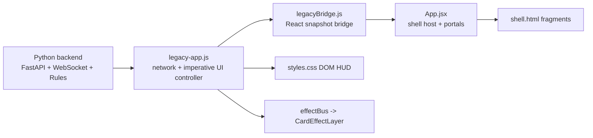
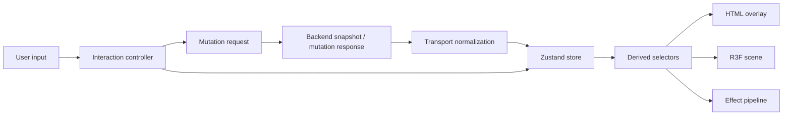

# Architecture

## Purpose

This document defines the current structural baseline and the target client architecture for the project.

## Current Baseline

The current client is a hybrid system, not a clean React app.

- `app/src/main.jsx`
  - mounts React and then imports `legacy-app.js`
- `app/src/App.jsx`
  - parses `shell.html` fragments and hosts the React shell
- `app/src/shell.html`
  - still acts as the real markup source for home, lobby, and game panels
- `app/src/legacyBridge.js`
  - exposes a tiny React-facing UI snapshot store
- `app/legacy-app.js`
  - owns networking, DOM mutation, dialogs, game flow, drag logic, timers, and result rendering
- `app/styles.css`
  - owns most layout, presentation, responsive rules, and current effect visuals
- `api_server.py`
  - owns session state, websocket broadcasts, long-poll fallback, and authoritative rule flow

## Current Architecture Diagram

## Architectural Diagnosis

### Strengths

- The backend already acts as the gameplay authority
- Transport already includes websocket plus polling fallback
- The effect bus already separates gameplay code from effect rendering
- The app already tries to feel like one continuous game client

### Weaknesses

- UI truth is split across backend snapshots, imperative state, React state, and DOM classes
- `legacy-app.js` has too many responsibilities
- `shell.html` makes component ownership difficult
- Type safety is weak
- There is no R3F scene boundary yet

## Target Client Layers

### 1. App Bootstrap Layer

Responsibilities:

- Discord Activity startup
- identity and session bootstrap
- asset preload boot flow
- root shell mounting

### 2. Game Application State Layer

Responsibilities:

- normalize backend snapshots
- store match, player, trick, bid, timer, and UI state
- expose derived selectors
- hold optimistic interaction state

Target implementation:

- Zustand slices
- selector-based subscriptions
- typed domain contracts

### 3. Presentation Layer

Split presentation into two surfaces:

- R3F Canvas
  - board, card actors, camera, lighting, world effects
- React HTML Overlay
  - HUD, dialogs, menus, settings, score, results

### 4. Interaction Layer

Responsibilities:

- unify mouse, touch, pointer, hover, hold, press, drag
- gate illegal moves
- emit interaction hints

### 5. Effect Layer

Responsibilities:

- receive typed effect events
- apply priority, cancel, stacking, and quality rules
- route work to overlay, world, camera, and score channels

### 6. Transport Layer

Responsibilities:

- websocket lifecycle
- polling fallback
- idempotent mutations
- reconnect metadata

## Target Module Boundaries

Recommended ownership layout:

- `src/app`
  - bootstrap, providers, app shell
- `src/domain`
  - pure game types and selectors
- `src/store`
  - Zustand slices and derived state
- `src/services`
  - transport, Discord SDK, persistence, telemetry
- `src/ui`
  - HUD, menus, overlays, dialogs
- `src/game`
  - game presenters and interaction coordinators
- `src/rendering`
  - `GameCanvas`, `GameScene`, `GameBoard`, `GameCamera`, `EffectScene`
- `src/effects`
  - typed event bus, presets, quality policy

## State Flow

## HTML Overlay vs Canvas Boundary

### Canvas Owns

- board geometry
- world-space card actors
- lighting
- camera motion
- world-space particles
- shockwaves and table reactions

### HTML Overlay Owns

- top HUD
- bid controls
- score drawer
- settings
- dialogs
- reconnect text
- accessibility-heavy text surfaces

### Shared Contract

- Overlay does not own gameplay authority
- Canvas does not own match truth
- Both read from the same typed store selectors

## legacyBridge Direction

`legacyBridge.js` should shrink over time, not grow.

Planned path:

1. Keep it as a temporary snapshot adapter
2. Move UI truth into the typed store
3. Replace fragment-driven views with components
4. Reduce the bridge to compatibility only
5. Remove it after the legacy shell is retired

## shell.html Dependency Removal Direction

Do not remove `shell.html` all at once.

Planned path:

1. Map ownership by fragment
2. Replace home, lobby, and game fragments one by one
3. Move dialogs into real React components
4. Keep `shell.html` only as a temporary migration source
5. Remove it after complete component replacement

## Backend Boundary

The Python backend remains the gameplay authority.

Frontend rules:

- do not duplicate rules authority in the client
- allow local interaction prediction only
- wrap backend payloads in typed adapters
- hide websocket versus polling details behind the transport layer

## Migration Guardrails

- Do not attempt a full rewrite in one pass
- Establish types before heavy R3F work
- Pair componentization with state normalization
- Keep effect evolution loosely coupled to transport changes

## Definition of Done

The architecture is moving in the right direction when:

- major screens no longer depend on raw HTML fragments
- UI state is normalized in typed store slices
- imperative DOM mutation is shrinking
- canvas and overlay responsibilities are clear
- effect orchestration is scene-aware instead of DOM-only
