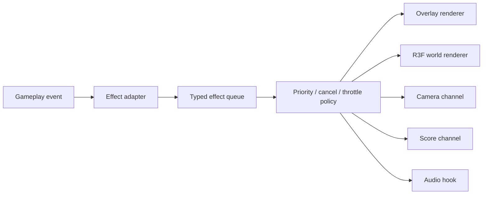

# Effect System

## Purpose

This document defines how the current `CardEffectLayer`, `effectBus`, and `effectPresets` should evolve into a production-grade effect pipeline.

## Current Files

- `app/src/cardEffects/effectBus.js`
- `app/src/cardEffects/CardEffectLayer.jsx`
- `app/src/cardEffects/effectPresets.js`

## Current Structure Analysis

### effectBus

Current role:

- infer card-based effect presets
- compute source, target, and highlight rectangles from the DOM
- dispatch a window event
- expose a bridge for legacy code

Strengths:

- effect rendering is already somewhat decoupled from gameplay logic
- source card cloning and fallback rendering already exist
- board-targeted effect scoping already exists

Limits:

- no type system
- no event priority
- no cancel or replace policy
- no quality tiers
- no explicit score, camera, or audio channels

### CardEffectLayer

Current role:

- queue effect requests
- render one active effect at a time
- use Framer Motion for travel, flash, particles, and impact
- apply reduced-motion behavior

Strengths:

- the current layer already has cinematic instincts
- it can reuse live card appearance via DOM cloning
- it already has a practical low-complexity fallback path

Limits:

- only one active effect can fully resolve at once
- no channel separation
- no overlap rules
- no R3F world-effect ownership boundary

### effectPresets

Current role:

- define theme, color, shake, timing, and particle behavior by card type

Strengths:

- semantic preset naming is already good
- special cards already have different visual personalities

Limits:

- no quality-tier branching
- no compositional preset model
- no explicit mapping from gameplay importance to system budget

## Target Effect Architecture

## Effect Event Model

An effect is not only a flying card. It is a multi-channel event.

Required metadata:

- event type
- gameplay importance
- source and target
- visual priority
- cancel policy
- stack policy
- quality tier
- performance cost class

Example event types:

- `card.play`
- `card.special.skullKing`
- `card.special.mermaid`
- `trick.resolve`
- `round.scoreDelta`
- `match.finish`
- `ui.turnUrgent`

## Channels

Each effect event may route to one or more channels:

- `board`
  - table ripple, surface crack, world glow
- `camera`
  - shake, nudge, drift, zoom
- `card`
  - travel, flip, vanish, land
- `particles`
  - slash, mist, water, curse, ember
- `overlay`
  - flash, vignette, emphasis text
- `score`
  - delta popup, crown, bid hit or miss cue
- `audio`
  - hit, resolve, warning, result cues

Canonical Stage 2 schema:

- `EffectChannel`
  - `board | camera | card | particles | overlay | score | audio`
- `EffectEventType`
  - `card.play`
  - `card.special.skullKing`
  - `card.special.mermaid`
  - `trick.resolve`
  - `round.scoreDelta`
  - `match.finish`
  - `ui.turnUrgent`
  - `camera.shake`

## Priority Rules

- `critical`
  - trick resolution, round settlement, blocking reconnect state
- `high`
  - Skull King, Kraken, White Whale, strong result cues
- `normal`
  - Pirate, Mermaid, normal card wins
- `low`
  - lightweight confirmations and ambient accents

Rules:

- higher priority may replace or suppress lower priority work
- `critical` may cancel stale low-priority queued effects
- repeated low-value events should coalesce instead of flooding the screen

## Cancel Rules

Cancel is required when:

- the app enters a blocking reconnect state
- authoritative state invalidates the visual assumption
- the user leaves the game view
- a stronger effect replaces a stale weaker one

Policies:

- `soft cancel`
  - finish quickly with a short fade
- `hard cancel`
  - stop immediately
- `replace`
  - terminate and swap to a newer event

## Stacking Rules

Allowed:

- card travel plus camera nudge
- trick resolution plus score pulse
- board ripple plus particle burst

Restricted:

- multiple heavy shakes at once
- chained full-screen flashes
- overlapping legendary-tier particle storms

## Throttling Rules

Throttle targets:

- repeated numbered card plays
- timer warning pulses
- repeated reconnect state cues
- spectator-side redundant score ticks

Example rules:

- suppress duplicate low-priority events inside 250ms windows
- limit low-priority particle bursts per second
- reduce impact ring frequency on mobile and in performance-lite mode

## Quality Tiers

- `ultra`
  - strong desktop hardware
- `high`
  - standard desktop
- `medium`
  - modern embedded devices
- `low`
  - low-end Discord mobile
- `lite`
  - emergency fallback that preserves clarity

As tier decreases, reduce:

- particle count
- layered vignette usage
- shake amplitude
- full-screen flash opacity
- concurrency of decorative effects

## Low-End Fallback

Always preserve:

- legal move clarity
- winner highlight
- card play acknowledgment
- turn urgency cue

Drop first:

- extra ring layers
- secondary particles
- blur-heavy accents
- decorative flashes
- long-lived screen darkening

## Card-Specific Direction

### Skull King

- cursed purple with toxic green accent
- heavy camera shake
- board crack or shockwave
- crown or curse sigil

### Pirate

- gold slash
- fast aggressive movement
- medium shake

### Mermaid

- water ribbon
- sea glow
- softer camera drift

### Escape

- smoke and fade
- low-impact resolution
- vanish cue

### Normal Suit

- short travel
- low-cost confirmation
- minimal screen interference

## Score Effects

The current system is weak on score feedback and must grow here.

Required score cues:

- trick winner emphasis
- score delta popup
- bid hit or miss tone
- round settlement emphasis
- final standing crown or defeat cue

## Camera Effects

After R3F enters the project, camera should be its own channel.

- `nudge`
  - basic card play
- `shake-light`
  - pirate, score impact
- `shake-heavy`
  - Skull King, Kraken, White Whale
- `drift`
  - Mermaid and calmer mystical states

Camera rules:

- never damage readability
- reduce amplitude and duration on mobile

## Bridge Strategy

Keep the current bridge as the ingress path while the system evolves.

Plan:

1. Type the effect bus
2. Define a standard event schema
3. Add priority, cancel, and throttle policies
4. Split overlay, score, camera, and world responsibilities
5. Add an `EffectScene` for R3F world effects

## Definition of Done

- each card family has a clear effect direction
- the event schema is typed
- priority, cancel, stack, throttle, and fallback rules are explicit
- DOM overlay and R3F world ownership are clearly separated
